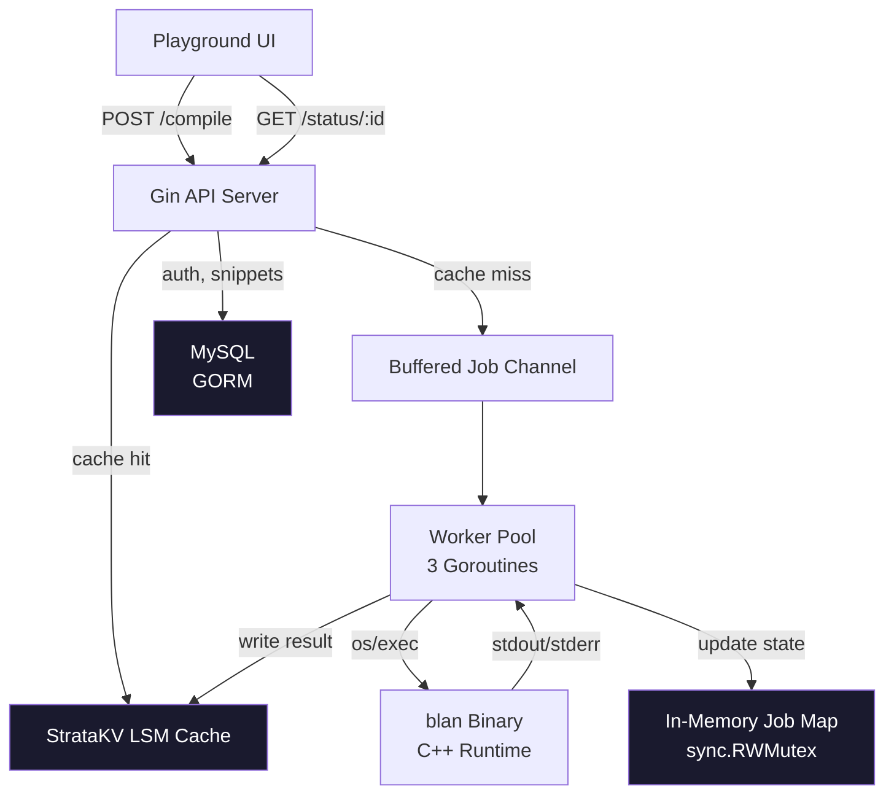
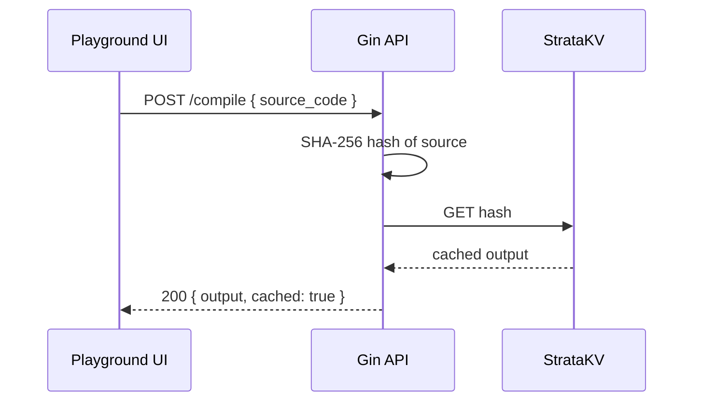
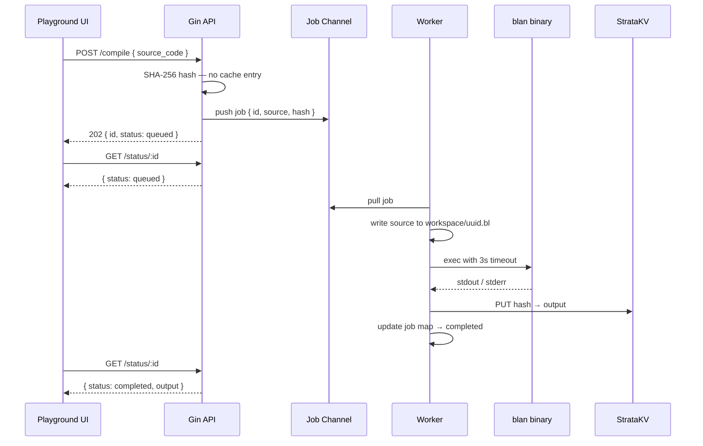
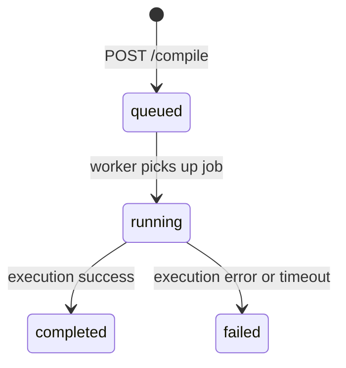
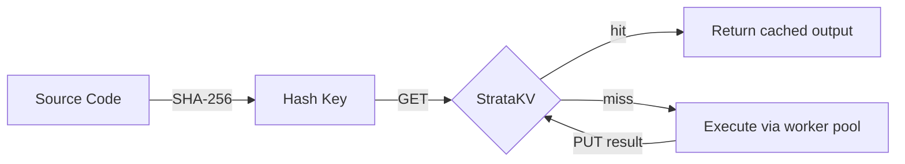
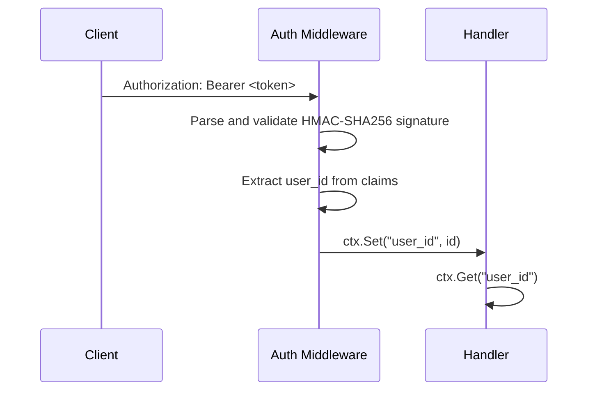

# Architecture

System design, data flow, and engineering decisions for the Blan backend.

---

## System Overview



---

## Request Lifecycle

### Cache Hit Path



### Cache Miss Path (Async Execution)



---

## Concurrency Model

The HTTP server and the compiler execution layer are fully decoupled.

`POST /compile` never blocks waiting for the C++ process. It immediately returns a `202 Accepted` with a job ID. The client polls `/status/:id` until the job reaches a terminal state.

Execution is bounded by a fixed worker pool backed by a buffered Go channel:

```
Workers:        3
Queue capacity: 100
Execution timeout per job: 3 seconds
```

The 3-second timeout is enforced via `context.WithTimeout` passed to `exec.CommandContext`. Jobs that exceed this are terminated and marked `failed` with an explicit timeout error message.

The in-memory job map is protected by `sync.RWMutex`. Reads (status polling) acquire a read lock. Writes (state transitions) acquire a write lock.



---

## Storage Strategy

Two storage engines handle distinct workloads. They are never used interchangeably.

### MySQL — Relational Layer

Handles all ACID-compliant, identity-sensitive data.

```
users       — credentials, hashed with bcrypt
snippets    — saved source code, foreign keyed to users
```

GORM manages schema migrations on startup via `AutoMigrate`. Migrations are additive only — no destructive operations are performed automatically.

### StrataKV — Execution Cache

A custom embedded LSM-tree key-value engine written in Go. Used exclusively as a lookup-aside cache for compiler output.

```
Key:   SHA-256 hex digest of source_code
Value: stdout of the blan binary
```



The LSM-tree write path appends to a Write-Ahead Log before updating the in-memory MemTable. Compaction merges SSTables in the background. This means cache writes are durable across server restarts.

StrataKV data is persisted in `./strata_cache_data/`. In Docker Compose this directory is mounted as a named volume so cache state survives container rebuilds.

---

## Authentication

JWT tokens are issued at `/login` and validated by `middleware/auth.go` on all protected routes.



Token expiry is 24 hours. The signing secret is read from the `JWT_SECRET` environment variable at startup. The server refuses to start if this variable is unset.

---

## Container Design

The Dockerfile uses a two-stage build:

```
Stage 1 — golang:1.26-bookworm
  - Downloads Go module dependencies
  - Builds a fully static Go binary with -ldflags "-s -w" and CGO_ENABLED=0

Stage 2 — debian:bookworm-slim
  - Copies only the Go binary and the blan C++ ELF binary
  - No Go toolchain in the final image
  - Runs as non-root appuser
```

The `workspace/` directory where `.bl` files are written during execution is mounted as `tmpfs` in Docker Compose. This means:

- Writes go directly to RAM — no disk I/O bottleneck
- No temporary files survive container restart
- Execution artifacts are never persisted to the host filesystem

---

## Known Constraints

These are intentional deferments, not oversights.

| Constraint                                | Impact                                        | Planned Resolution                             |
| ----------------------------------------- | --------------------------------------------- | ---------------------------------------------- |
| Job state is in-memory only               | State lost on server restart                  | Migrate job map to MySQL `jobs` table          |
| Execution isolation is process-level only | No CPU or memory quota per job                | Replace `os/exec` with `nsjail` or cgroups     |
| No memory cleanup on job map              | Long-running server accumulates stale entries | Background `time.Ticker` pruning daemon        |
| No rate limiting on `/compile`            | Burst traffic can fill the job queue          | Per-IP rate limiter middleware                 |
| Single-node StrataKV                      | Cache is not distributed                      | Acceptable for current scale                   |
| Short-lived access token only             | No token refresh mechanism                    | Dual-token system with HttpOnly refresh cookie |
